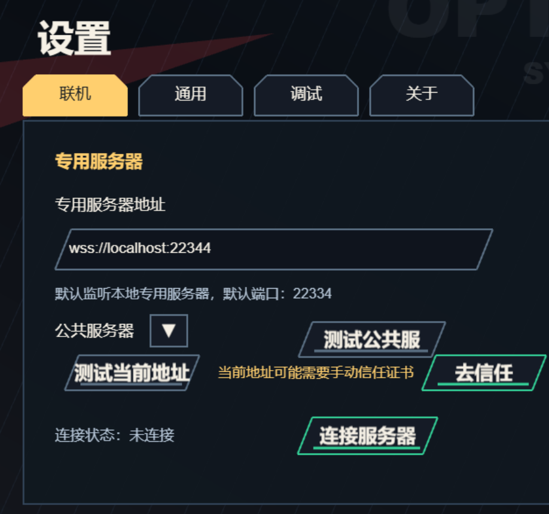

# Dedicated Server 部署指南

本指南将帮助您搭建属于自己的游戏服务器。即使您没有太多的计算机基础，按照以下步骤操作也能轻松完成。

---

## 目录
- [第一步：准备工作](#第一步准备工作)
- [第二步：安装运行环境](#第二步安装运行环境)
- [第三步：启动服务器（基础方法）](#第三步启动服务器基础方法)
- [第四步：在游戏中连接](#第四步在游戏中连接)
- [进阶配置（可选）](#进阶配置可选)
  - [1. 配置安全连接 (SSL/TLS)](#1-配置安全连接-ssltls)
  - [2. 使用 PM2 后台运行](#2-使用-pm2-后台运行)
  - [3. 使用 Docker 部署](#3-使用-docker-部署)

---

## 第一步：准备工作

1. 前往 [GitHub Releases](https://github.com/scarletborder/FXTZ-arena/releases) 页面。
2. 下载打包好的专用服务端压缩包，文件名类似：`fxtz-arena-dedicated-server-v0.3.7+192.tar.gz`（版本号可能会有所不同）。
3. 下载后，将压缩包解压到一个您找得到的文件夹中（例如电脑桌面或 D 盘）。解压后您会看到一个包含 `dist` 文件夹、`ecosystem.config.cjs` 等文件的目录。

---

## 第二步：安装运行环境

本服务器基于 Node.js 运行，您需要先在电脑上安装它：

1. 打开 [Node.js 官方下载页面](https://nodejs.org/en/download)。
2. 选择 **Prebuilt Installer**（预构建安装包）下载适合您系统的版本（建议下载推荐的 **LTS** 版本，版本需在 **20.x 或以上**）。
3. 双击下载好的安装包，一路点击“下一步”（Next）完成安装即可。

---

## 第三步：启动服务器（基础方法）

安装好 Node.js 后，请按照以下步骤启动服务器：

### 1. 打开终端（命令行窗口）
* **Windows 用户**：
  打开您刚才解压出来的文件夹。在文件夹上方的**地址栏**（显示文件夹路径的地方，例如 `D:\Downloads\...`）点击一下，清空里面的文字，输入 **`cmd`** 然后按下键盘上的 **Enter (回车) 键**。
  *(这会直接在该文件夹下打开一个黑色背景的命令行窗口)*。
* **macOS 用户**：
  右键点击解压后的文件夹，选择 **「新建位于文件夹的终端窗口」**（或「服务」->「新建位于文件夹的终端窗口」）。

### 2. 输入运行命令
在打开的终端窗口中，输入以下命令并按下回车：

```bash
node dist/index.js
```

### 3. 确认启动成功
如果启动成功，您的终端会输出类似下面的文字：

```text
You are running FXTZ_area dedicated server.  Version: v0.1.0+35
Dedicated server listening on ws://0.0.0.0:22334 
```
*这代表您的服务器已经在本地的 `22334` 端口成功运行。*

> **提示：如何设置自定义端口或地址？**
> 如果您想修改默认的端口，可以使用以下命令启动（在 Windows 环境下部分终端可能不支持此格式，建议直接使用默认设置，或参考下文的 PM2 部署）：
> ```bash
> HOST=0.0.0.0 PORT=22334 node dist/index.js
> ```

---

## 第四步：在游戏中连接

要让您和好友进入服务器，请按以下步骤操作：

### 1. 获取服务器 IP 地址
* **如果您和好友在同一个 WiFi/局域网内**：
  在您的终端中输入 `ipconfig` (Windows) 或 `ifconfig` (macOS/Linux) 查看您的局域网 IP（通常是以 `192.168.x.x` 开头）。
* **如果好友在异地（需要通过互联网连接）**：
  您需要确保您的网络有公网 IP 并设置了路由器端口映射，或者使用第三方内网穿透工具（如 cpolar、樱花 frp 等）。您可以在浏览器中搜索“本机 IP”来获取您的外网 IP。

### 2. 在游戏客户端中输入地址
1. 打开游戏客户端，进入联机页面。
2. 在服务器地址栏中输入：`ws://<您的IP地址>:22334`（例如：`ws://192.168.1.5:22334`）。
3. 如果连接成功，界面会显示绿色提示。

---

## 进阶配置（可选）

*注：以下内容适合对计算机或网络有一定了解的用户。如果您只是本地游玩，可以忽略。*

### 1. 配置安全连接 (SSL/TLS)

如果您希望服务器支持加密的 `wss://` 协议，可以配置证书。

#### 方式一：自动生成并使用自签名证书
如果您没有购买正式证书，可以让服务端软件自动为您生成：
```bash
node dist/index.js --pem-dir=/path/to/pems
```
* 服务器会检查指定目录下是否存在 `cert.pem` 和 `key.pem`。
* 如果不存在，会自动在指定目录创建一对自签名证书。

#### 方式二：使用您现有的证书
如果您已经有申请好的证书文件，可以直接指定路径：
```bash
node dist/index.js --cert=/path/to/cert.pem --key=/path/to/key.pem
```
> **注意**：`--cert` 和 `--key` 必须成对提供，且不能与 `--pem-dir` 参数混合使用。

#### 启用安全连接后的使用说明
启用证书后，控制台会输出 `wss://0.0.0.0:22334`。由于自签名证书不被浏览器默认信任，您和好友需要：
1. 在[设置]->[联机]输入：`https://<您的服务器IP>:22334/echo`
2. 点击[测试当前地址]，会显示"当前地址需要手动信任证书"， 点击[去信任]
3. 浏览器会弹出“您的连接不是私密连接”的安全警告，请点击 “高级”/“Details” -> **“继续前往/信任该证书”**/"Visit this site"。
4. 随后即可在游戏中使用 `wss://<您的服务器IP>:22334/` 地址进行安全连接。



#### 同时开启 WT (WebTransport) 协议服务

```bash
node dist/index.js --pem-dir=/path/to/pems --wt
```

wt协议可为游戏提供更低的延迟体验，浏览器中游戏无法通过wt协议连接自签名证书服务器。

---

### 2. 使用 PM2 后台运行

PM2 是一个守护进程管理器，可以保持您的服务器 24 小时不间断运行，即使关闭终端窗口也不会停止。

1. 安装 PM2：
   ```bash
   npm install pm2 -g
   ```
2. 确认解压目录下有 `ecosystem.config.cjs` 文件（默认内容已为您配置好，可根据需要修改其中的端口和证书路径）。
3. 在该目录下运行以下命令启动服务：
   ```bash
   pm2 start ecosystem.config.cjs
   ```
4. 如果需要了解更多 PM2 的日常管理命令（如查看状态、停止、重启等），可以访问 [PM2 中文文档](https://pm2.node.org.cn/)。

---

### 3. 使用 Docker 部署

如果您习惯使用 Docker 容器化部署：

1. 导入镜像文件：
   ```bash
   docker load -i fxtz-arena-dedicated-server-image-v1.0.0+23456.tar.gz
   ```
2. 运行镜像（请将端口映射到您的宿主机）：
   ```bash
   docker run --rm -p 22334:22334 fxtz-arena-dedicated-server:v1.0.0
   ```